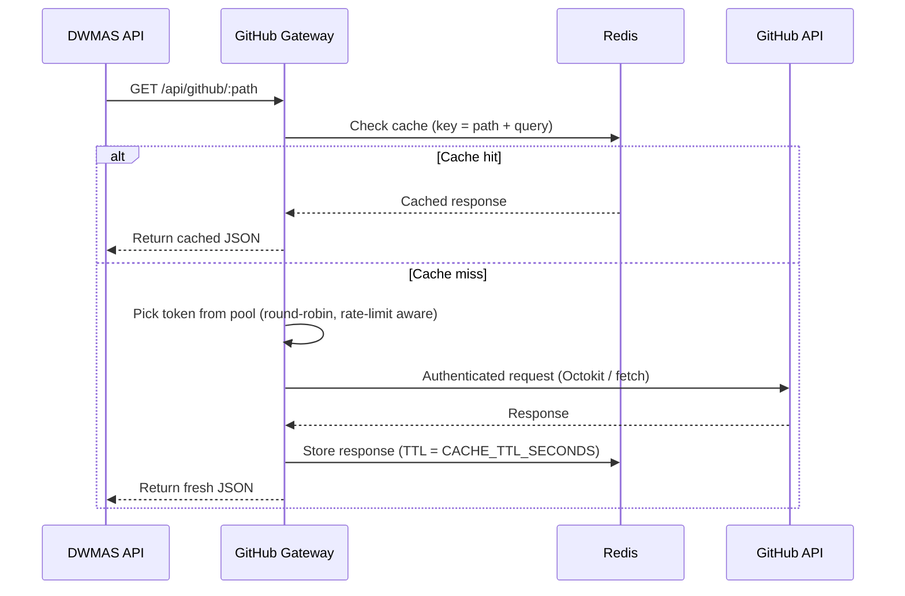
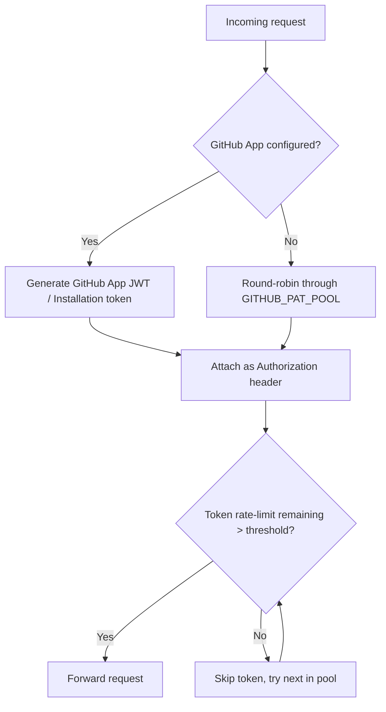

# GitHub Gateway

Express-based reverse proxy that fronts all outbound GitHub API calls. It pools tokens (GitHub App credentials + PATs), enforces rate-limit awareness, and caches GET responses in Redis. Prometheus metrics and a health endpoint are included for observability.

## What it does

- Proxies requests under `/api/github/*` to GitHub with pooled tokens and rate-limit awareness.
- Caches GET responses in Redis for `CACHE_TTL_SECONDS`.
- Exposes `/metrics` (Prometheus) and `/health` for service health monitoring.
- Provides `/cache` admin endpoints for cache inspection and invalidation.

---

## Request Flow



---

## Token Pool Strategy



The pool prioritises GitHub App credentials (finer-grained permissions, higher rate limits) and falls back to personal access tokens (PATs) from `GITHUB_PAT_POOL`.

---

## Routes

| Method | Path                        | Description                                |
|--------|-----------------------------|--------------------------------------------|
| `*`    | `/api/github/*`             | Proxy any GitHub API path.                 |
| `GET`  | `/health`                   | Liveness check; returns `{ status: "ok" }`. |
| `GET`  | `/metrics`                  | Prometheus metrics (request count, latency, cache hit/miss ratio). |
| `GET`  | `/cache`                    | List cached keys.                          |
| `DELETE` | `/cache/:key`             | Invalidate a cached entry.                 |

---

## Code Structure

```text
src/
  index.ts                  # Express app entry; mounts all routers
  config/
    env.ts                  # Env validation (zod/dotenv)
  lib/
    logger.ts               # Pino logger instance
    tokenPool.ts            # Token pool + rate-limit tracking
  middleware/
    errorHandler.ts         # Centralised error response
  routes/
    github.ts               # /api/github proxy handler
    health.ts               # /health
    metrics.ts              # /metrics (prom-client)
    cache.ts                # /cache admin endpoints
  services/
    githubService.ts        # Octokit wrapper + request dispatch
    cacheService.ts         # Redis get/set/delete helpers
```

---

## Scripts

```bash
pnpm install
pnpm --filter @dwmas/github-gateway dev    # ts-node-dev hot reload
pnpm --filter @dwmas/github-gateway build  # tsc output to dist/
pnpm --filter @dwmas/github-gateway start  # runs dist/index.js
pnpm --filter @dwmas/github-gateway test   # vitest
```

---

## Environment

Set via `.env` / `.env.example` (shared with docker-compose):

| Variable                  | Required | Description                                                  |
|---------------------------|----------|--------------------------------------------------------------|
| `REDIS_URL`               | ✅       | Redis connection string, e.g. `redis://localhost:6379`.      |
| `GITHUB_APP_ID`           | ⬜       | GitHub App ID for app-based auth.                            |
| `GITHUB_APP_PRIVATE_KEY`  | ⬜       | PEM private key for the GitHub App.                          |
| `GITHUB_APP_CLIENT_ID`    | ⬜       | GitHub App OAuth Client ID.                                  |
| `GITHUB_APP_CLIENT_SECRET`| ⬜       | GitHub App OAuth Client Secret.                              |
| `GITHUB_PAT_POOL`         | ⬜       | Comma-separated list of PATs used when App auth is absent.   |
| `GITHUB_API_URL`          | ⬜       | Defaults to `https://api.github.com`.                        |
| `CACHE_TTL_SECONDS`       | ⬜       | How long GET responses are cached. Default: `60`.            |

---

## Docker

The compose service `github-gateway` builds from `apps/github-gateway/Dockerfile`, binds host **4400** → container **4000**, and depends on Redis:

```yaml
# from docker-compose.yml
github-gateway:
  build: apps/github-gateway
  ports:
    - "4400:4000"
  depends_on:
    - redis
```

---

## Related docs

- [`docs/architecture.md`](../../docs/architecture.md) — system-level overview showing where the gateway fits.
- [`docs/workflow-sync-sequence.md`](../../docs/workflow-sync-sequence.md) — how the API uses the gateway during workflow sync.