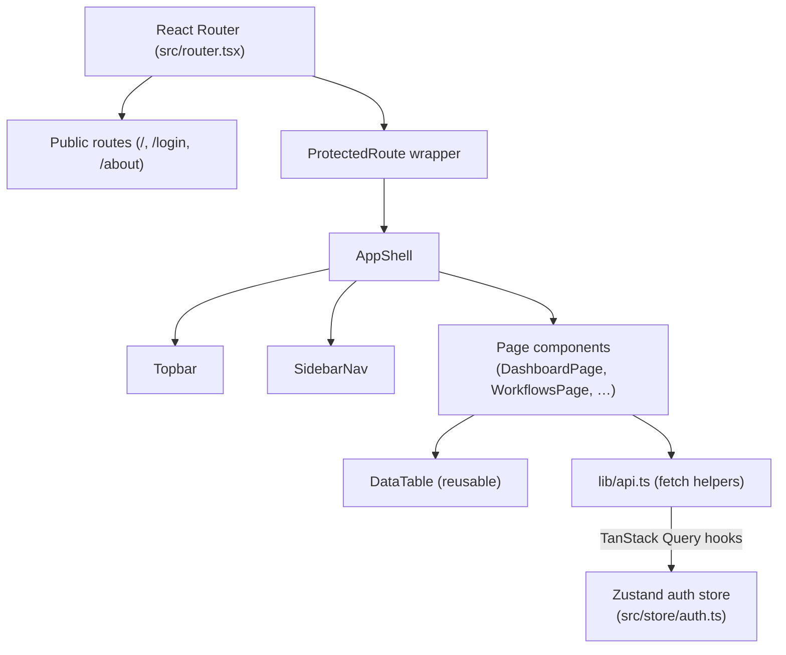
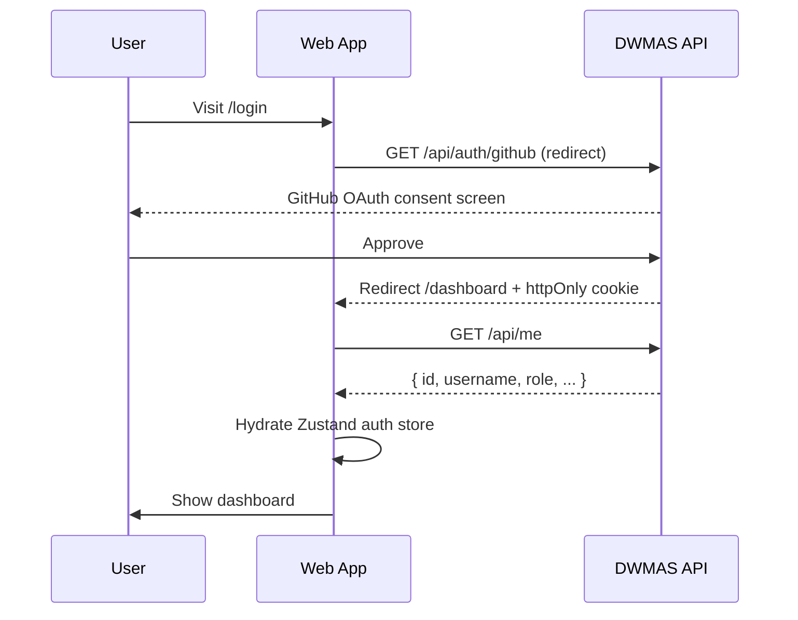
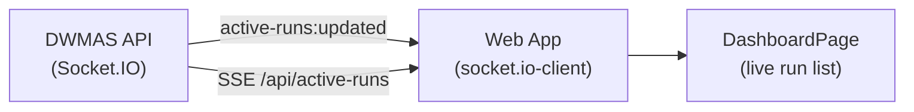

# Web (Frontend)

Vite + React 18 (TypeScript) SPA for the DWMAS dashboard. Talks to the API for auth, analytics, issues, repositories, and realtime updates over Socket.IO and SSE.

---

## Page Map

| Route                                     | Page Component          | Role required       |
|-------------------------------------------|-------------------------|---------------------|
| `/`                                       | `HomePage`              | Public              |
| `/login`                                  | `LoginPage`             | Public (unauthenticated) |
| `/about`                                  | `AboutPage`             | Public              |
| `/dashboard`                              | `DashboardPage`         | Any authenticated   |
| `/repositories`                           | `RepositoriesPage`      | Any authenticated   |
| `/workflows`                              | `WorkflowsPage`         | Any authenticated   |
| `/workflows/:workflowId`                  | `WorkflowDetailsPage`   | Any authenticated   |
| `/issues/:issueId`                        | `IssueDetailsPage`      | Any authenticated   |
| `/analytics`                              | `AnalyticsPage`         | DevOps / Admin      |
| `/reports`                                | `ReportsPage`           | DevOps / Admin      |
| `/users`                                  | `UsersPage`             | Admin only          |
| `/profile`                                | `ProfilePage`           | Any authenticated   |

---

## Component Architecture



---

## Auth / Session Flow



See [`docs/oauth-sequence.md`](../../docs/oauth-sequence.md) for the full sequence.

---

## State Management

| Layer            | Library            | Responsibility                                         |
|------------------|--------------------|--------------------------------------------------------|
| Server state     | TanStack Query     | Fetch, cache, and invalidate API data per route.       |
| Auth state       | Zustand            | Current user, role, hydration from `/api/me`.          |
| UI/local state   | React `useState`   | Form inputs, modals, filter panels.                    |

---

## Realtime Updates

The dashboard connects to the API's Socket.IO server to receive live `active-runs:updated` events and refreshes the active workflow run list without polling.



---

## Scripts

```bash
pnpm install
pnpm --filter @dwmas/web dev      # start dev server on :5173
pnpm --filter @dwmas/web build    # type-check + production build
pnpm --filter @dwmas/web preview  # serve the built app
pnpm --filter @dwmas/web lint     # eslint
pnpm --filter @dwmas/web test     # vitest unit tests
```

---

## Environment

Configured via `.env` / `.env.example` in repo root. Vite exposes only variables prefixed with `VITE_`:

| Variable          | Description                                     | Example                        |
|-------------------|-------------------------------------------------|--------------------------------|
| `VITE_API_URL`    | Base URL for REST API calls.                    | `http://localhost:4000/api`    |
| `VITE_API_WS_URL` | Socket.IO server origin.                        | `http://localhost:4000`        |

---

## Docker

The compose service `web` builds from `apps/web/Dockerfile` and binds host **5174** → container **5173**, depending on the `api` service:

```yaml
# from docker-compose.yml
web:
  build: apps/web
  ports:
    - "5174:5173"
  depends_on:
    - api
```

---

## Key Files

| File / Directory            | Purpose                                                     |
|-----------------------------|-------------------------------------------------------------|
| `src/router.tsx`            | Route definitions; wraps private routes in `ProtectedRoute`.|
| `src/store/auth.ts`         | Zustand store: current user, loading, login/logout actions. |
| `src/lib/api.ts`            | Typed fetch helpers for all API endpoints.                  |
| `src/lib/status.ts`         | Sync/run status badge helpers.                              |
| `src/components/AppShell.tsx` | Shell layout: sidebar + topbar + outlet.                  |
| `src/components/ProtectedRoute.tsx` | Redirects unauthenticated users to `/login`.        |
| `src/components/ui/DataTable.tsx`   | Generic sortable/filterable table component.        |
| `tailwind.config.ts`        | Tailwind theme and plugin configuration.                    |

---

## Related docs

- [`docs/architecture.md`](../../docs/architecture.md) — full system architecture.
- [`docs/oauth-sequence.md`](../../docs/oauth-sequence.md) — GitHub OAuth login sequence.
- [`docs/workflow-sync-sequence.md`](../../docs/workflow-sync-sequence.md) — workflow sync from GitHub to UI.