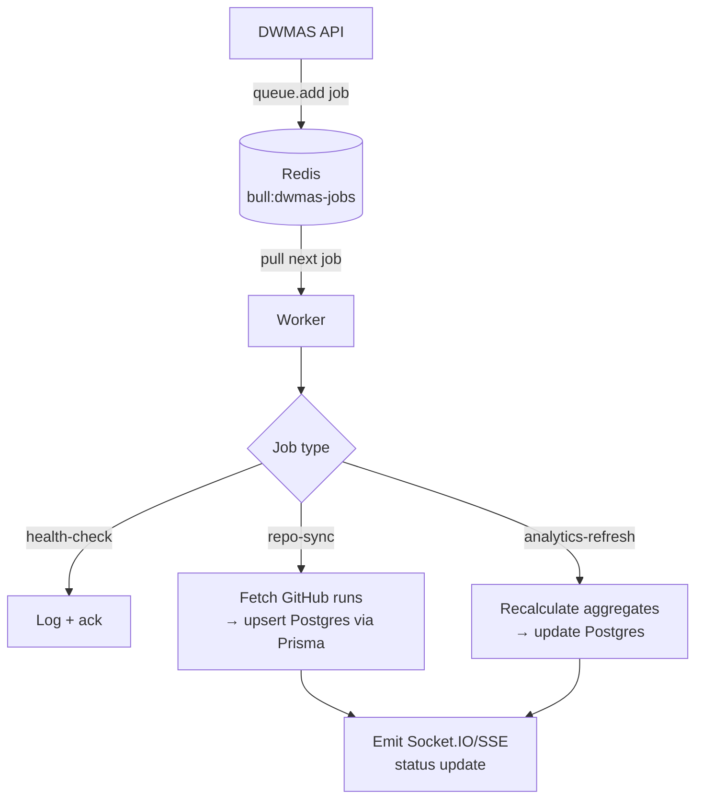
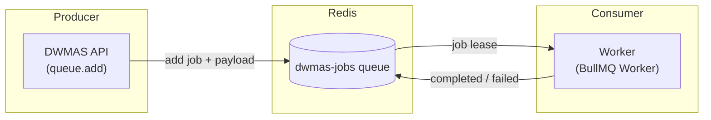

# Worker

Background job worker built with [BullMQ](https://docs.bullmq.io/) and Redis. It processes queued jobs from the `dwmas-jobs` queue — currently a health-check placeholder — and is the place to add retries, delays, cooldowns, and alerting for longer-running tasks such as repository sync and analytics refresh.

---

## What it does

- Connects to Redis (`REDIS_URL`) and listens on the **`dwmas-jobs`** queue.
- Enqueues a `health-check` job on startup to verify Redis connectivity.
- Processes jobs via BullMQ `Worker`; logs each processed job to stdout.
- Extend `src/index.ts` with real job processors for sync, analytics, and notifications.

---

## Job Processing Flow



> The `repo-sync` and `analytics-refresh` branches show **planned/suggested** processors — implement them in `src/index.ts` or dedicated modules.

---

## Queue Architecture



BullMQ stores job state in Redis sorted sets. Failed jobs are retried according to `attempts` in `JobsOptions`; completed jobs are retained for a configurable duration.

---

## Extending with Real Processors

Register named processors in the `Worker` constructor callback:

```typescript
new Worker(
  'dwmas-jobs',
  async (job) => {
    switch (job.name) {
      case 'repo-sync':
        await syncRepository(job.data.repositoryId);
        break;
      case 'analytics-refresh':
        await refreshAnalytics(job.data.repositoryId);
        break;
      case 'health-check':
      default:
        console.log('health-check ok', job.data);
    }
  },
  { connection }
);
```

Recommended patterns:
- Use `job.updateProgress()` to stream progress to the API (which forwards to clients over Socket.IO).
- Set `attempts` and `backoff` in `JobsOptions` for automatic retries with exponential back-off.
- Use BullMQ `repeat` option for cron-style periodic sync.

---

## Run locally

```bash
pnpm install
pnpm --filter @dwmas/worker dev   # ts-node-dev, watches src/
```

## Build & start (compiled)

```bash
pnpm --filter @dwmas/worker build
pnpm --filter @dwmas/worker start
```

## Tests

```bash
pnpm --filter @dwmas/worker test
```

---

## Docker

The compose service `worker` builds from `apps/worker/Dockerfile` and depends on Redis and the GitHub gateway:

```yaml
# from docker-compose.yml
worker:
  build: apps/worker
  depends_on:
    - redis
    - github-gateway
```

---

## Environment

| Variable    | Default                      | Description                        |
|-------------|------------------------------|------------------------------------|
| `REDIS_URL` | `redis://localhost:6379`     | Redis connection string.            |

In docker-compose the service uses `redis://redis:6379` (Docker network hostname).

---

## Related docs

- [`docs/architecture.md`](../../docs/architecture.md) — shows the worker's place in the overall system.
- [`docs/workflow-sync-sequence.md`](../../docs/workflow-sync-sequence.md) — sequence diagram for repository/workflow sync.