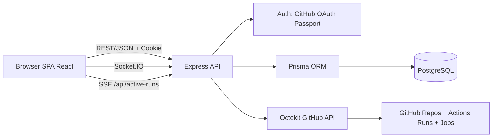

# DWMAS Architecture Diagram

## Notes
- SPA handles public and protected views.
- API enforces RBAC and repository-level access.
- **Source of truth:** GitHub (repositories/workflow runs/jobs).
- **PostgreSQL role:** cache/snapshot/history for fast reads, analytics and reporting.
- Sync strategy is hybrid:
  - eager sync on repository connect
  - manual sync on demand
  - lazy/background refresh for stale repository/workflow reads
