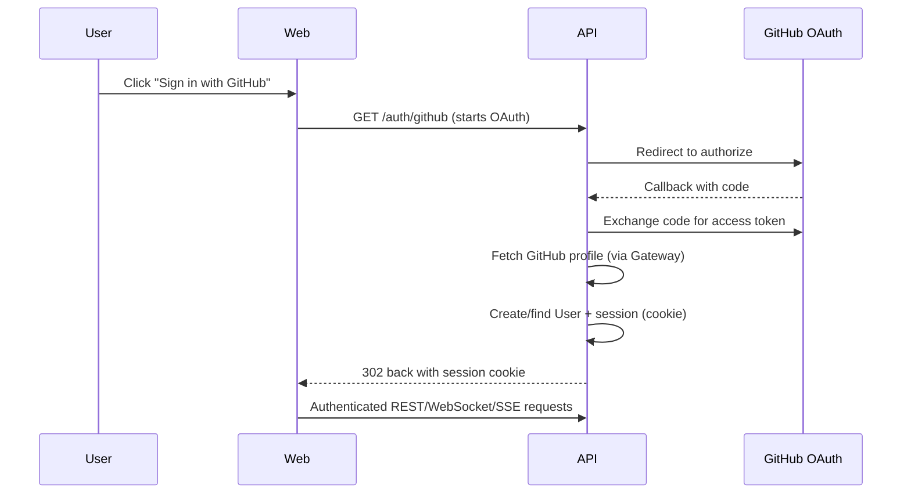
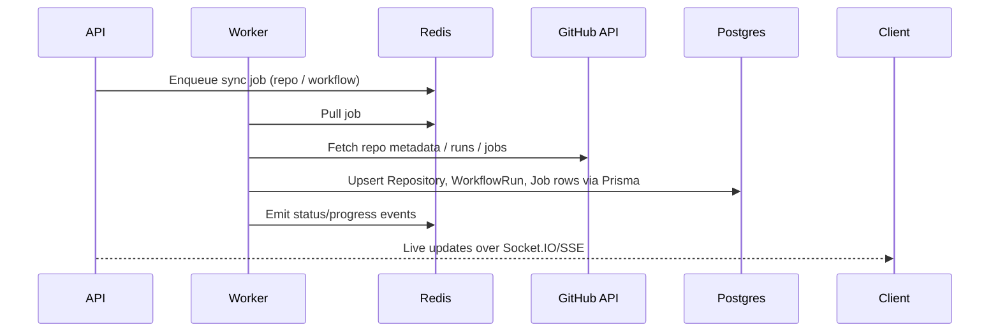
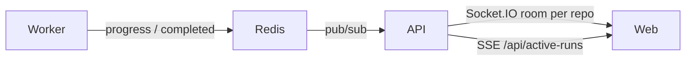
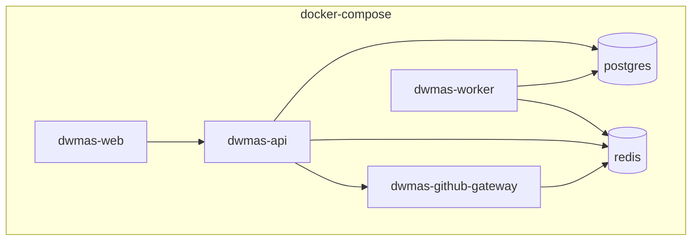

# DWMAS Architecture

## High-level view

```mermaid
flowchart LR
  subgraph Client
    A["React SPA (web)"]
  end

  subgraph Platform
    B["API (Express + Prisma)"]
    C[GitHub Gateway]
    D[Worker]
    E[(PostgreSQL)]
    F[(Redis)]
  end

  subgraph External
    G["GitHub API"]
  end

  A -->|REST/JSON + cookies| B
  A -->|Socket.IO + SSE| B
  B -->|Auth (GitHub OAuth)| C
  B -->|DB reads/writes| E
  B <-->|Pub/Sub events| F
  C -->|Octokit| G
  D -->|Queues (BullMQ)| F
  D -->|Syncs data| G
  D -->|Persist snapshots| E
  B -->|Dispatch sync jobs| D
```

### Key ideas

- Browser SPA talks only to the API; real-time updates use Socket.IO and SSE.
- API owns auth/session, RBAC, and business logic; Prisma mediates persistence to Postgres.
- GitHub Gateway centralizes outbound GitHub traffic (tokens, rate limits, app credentials).
- Worker consumes background jobs from Redis (BullMQ) to sync repositories, workflow runs, jobs, and analytics.
- Postgres stores cached state and reporting data; GitHub remains the source of truth.
- Redis is both the queue backend and lightweight pub/sub for live updates.

## Authentication & session flow



Notes:

- Passport GitHub strategy handles the OAuth handshake.
- Session/JWT secrets are configured via environment; cookies secure the SPA.

## Data sync (repositories, workflow runs, jobs)



Sync strategy:

- Eager on repository connect.
- Manual on-demand via API endpoints.
- Periodic/background refresh for stale data.

## Real-time updates



Events include sync progress, new workflow runs, job updates, and analytics refresh triggers.

## Deployment (local dev)



- `docker compose up -d` builds and runs all services.
- `pnpm --filter @dwmas/api exec prisma migrate deploy` applies schema to Postgres.
- Environment variables in `.env.example` configure secrets, GitHub App credentials, and container hostnames.

## Tables of interest

- `Repository`, `WorkflowRun`, `Job` — synced from GitHub; include status, timing, and links.
- `Issue`, `Comment` — issue tracking mirrored from GitHub.
- `ReportTemplate`, `AuditLog` — local-only reporting and audit history.

## Operational notes

- GitHub remains the source of truth; Postgres is a cache and analytics store.
- If schema errors occur (missing tables), run migrations before starting the app.
- Redis `maxRetriesPerRequest` should be `null` (BullMQ recommendation) to avoid deprecation warnings.
