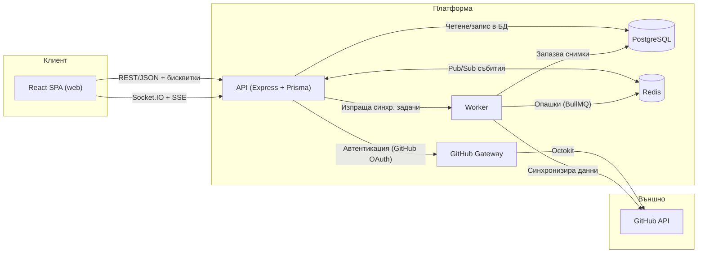
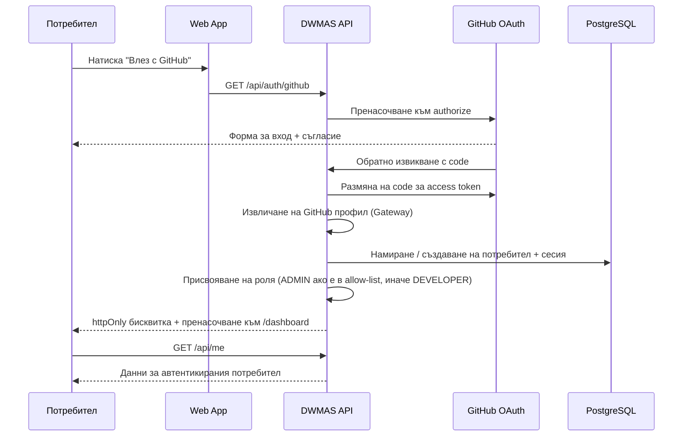
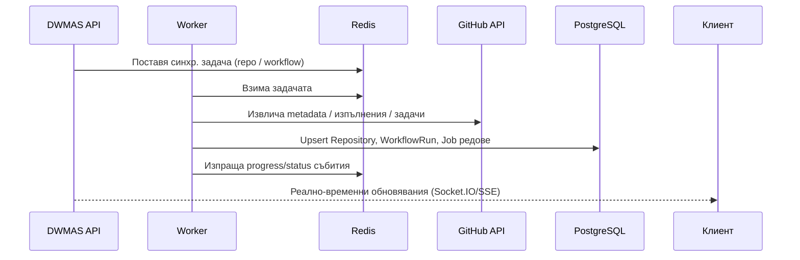
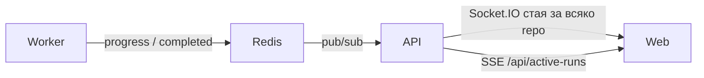
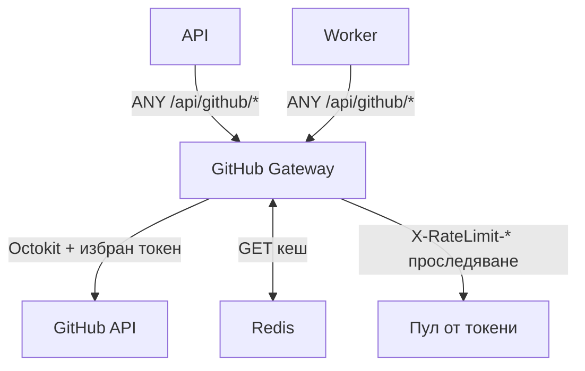
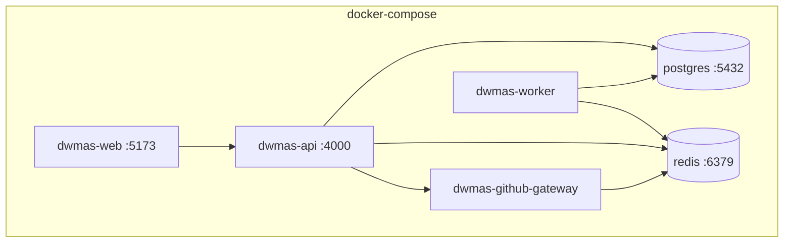

# Системна архитектура

## Обща схема



### Ключови идеи

- **React SPA** комуникира само с API-то; реално-временните обновявания минават през Socket.IO и SSE.
- **API** притежава автентикацията, сесиите, RBAC и бизнес логиката; Prisma медиира достъпа до PostgreSQL.
- **GitHub Gateway** централизира изходящия GitHub трафик – токени, rate limits, App credentials.
- **Worker** консумира фонови задачи от Redis (BullMQ) за синхронизация на хранилища, workflow изпълнения, задачи и аналитика.
- **PostgreSQL** съхранява кешираното състояние и аналитичните данни; GitHub остава истинният източник.
- **Redis** е едновременно опашков бекенд (BullMQ) и лек pub/sub за реално-временни обновявания.

---

## Автентикация и сесии



**Бележки:**
- Passport GitHub strategy управлява OAuth handshake-а.
- Сесийните/JWT секрети се конфигурират чрез env; бисквитките защитават SPA.

---

## Синхронизация на данни



**Стратегия за синхронизация:**
- **Активна** – при свързване на хранилище
- **Ръчна** – при натискане на "Sync runs"
- **Фонова/периодична** – при остарели данни или `refresh=true`

**Метаданни за синхронизация на хранилище:**

| Поле | Стойности |
|---|---|
| `syncStatus` | `IDLE` \| `SYNCING` \| `SUCCESS` \| `ERROR` |
| `lastSyncedAt` | Последно опит |
| `lastSuccessfulSyncAt` | Последен успех |
| `syncError` | Текст на грешката |
| `sourceUpdatedAt` | Последна промяна в GitHub |

---

## Реално-временни обновявания



Събитията включват: прогрес на синхронизация, нови workflow изпълнения, обновявания на задачи, тригери за обновяване на аналитиката.

---

## GitHub Gateway



| Функция | Описание |
|---|---|
| Пул от токени | GitHub App (основен) + PAT резерв |
| Превантивно превключване | При < 20% оставаща квота |
| Кеширане | Само GET заявки; конфигурируемо TTL (по подразбиране 60 с) |
| Инвалидиране | `DELETE /cache` или `DELETE /cache/prefix` |
| Метрики | Prometheus + alert hooks |

---

## Разгръщане (локална среда)



```bash
# Стартиране на всички услуги
docker compose up -d

# Прилагане на схемата
pnpm --filter @dwmas/api exec prisma migrate deploy
```

---

## База данни – ключови таблици

| Таблица | Произход | Описание |
|---|---|---|
| `Repository` | GitHub | Metadata за хранилището, статус на синхр. |
| `WorkflowRun` | GitHub | Изпълнения на workflow: статус, клон, актьор |
| `Job` | GitHub | Отделни задачи в рамките на изпълнение |
| `Issue` | GitHub / локални | Проблеми, огледани от GitHub Issues |
| `Comment` | GitHub / локални | Коментари към issues |
| `ReportTemplate` | Локални | Запазени конфигурации на филтри за отчети |
| `AuditLog` | Локални | История на действията (кой, кога, какво) |
| `User` | Локални | Профил от GitHub OAuth + роля + статус |
| `UserRepositoryAssignment` | Локални | RBAC: кой потребител до кое хранилище |

---

## Оперативни бележки

- GitHub е истинският източник; PostgreSQL е кеш и аналитично хранилище.
- При грешки за липсващи таблици – стартирай миграциите преди приложението.
- Redis `maxRetriesPerRequest` трябва да е `null` (препоръка на BullMQ).
