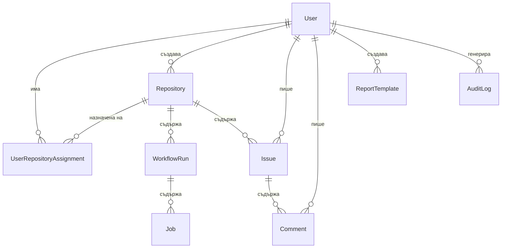

# Модел на данните

Каноничната Prisma схема е в [prisma/schema.prisma](../../prisma/schema.prisma).

---

## Обща ERD схема



---

## Таблици

### User

Профил, създаден при първо GitHub OAuth влизане.

| Поле | Тип | Описание |
|---|---|---|
| `id` | cuid | Вътрешен ID |
| `githubId` | string (unique) | GitHub user ID |
| `username` | string (unique) | GitHub username |
| `displayName` | string? | Показвано име |
| `email` | string? | Имейл от GitHub |
| `avatarUrl` | string? | URL на аватара |
| `role` | Role | `DEVELOPER` \| `DEVOPS` \| `ADMIN` |
| `isActive` | bool | Мека деактивация |
| `createdAt` | DateTime | Дата на създаване |

---

### Repository

Хранилище, свързано с платформата.

| Поле | Тип | Описание |
|---|---|---|
| `id` | cuid | Вътрешен ID |
| `githubRepoId` | string (unique) | GitHub repo ID |
| `owner` | string | GitHub org/user |
| `name` | string | Кратко име |
| `fullName` | string (unique) | `owner/name` |
| `isPrivate` | bool | Дали е частно |
| `defaultBranch` | string | Главен клон |
| `syncStatus` | SyncStatus | `IDLE/SYNCING/SUCCESS/ERROR` |
| `lastSyncedAt` | DateTime? | Последен опит за синхр. |
| `lastSuccessfulSyncAt` | DateTime? | Последна успешна синхр. |
| `syncError` | string? | Текст при грешка |
| `sourceUpdatedAt` | DateTime? | Последна промяна в GitHub |

---

### WorkflowRun

Едно изпълнение на GitHub Actions workflow.

| Поле | Тип | Описание |
|---|---|---|
| `id` | cuid | Вътрешен ID |
| `githubRunId` | string (unique) | GitHub run ID |
| `repositoryId` | cuid | FK → Repository |
| `workflowName` | string | Име на workflow |
| `status` | string | `queued/in_progress/completed` |
| `conclusion` | string? | `success/failure/cancelled/...` |
| `branch` | string? | Клон |
| `event` | string? | Тригер (push, PR, ...) |
| `actor` | string? | Потребителят, задействал |
| `commitSha` | string? | Хеш на commit |
| `startedAt` | DateTime? | Начало |
| `completedAt` | DateTime? | Край |
| `durationMs` | int? | Продължителност в мс |

**Индекси:** `(repositoryId, status)`, `(startedAt)`

---

### Job

Отделна задача в рамките на WorkflowRun.

| Поле | Тип | Описание |
|---|---|---|
| `id` | cuid | Вътрешен ID |
| `githubJobId` | string (unique) | GitHub job ID |
| `workflowRunId` | cuid | FK → WorkflowRun |
| `name` | string | Nazwa задачата |
| `status` | string | Статус |
| `conclusion` | string? | Резултат |
| `startedAt` | DateTime? | Начало |
| `completedAt` | DateTime? | Край |
| `durationMs` | int? | Продължителност в мс |
| `runnerName` | string? | Runner ID |

---

### Issue

Проблем, свързан с хранилище (локален или синхронизиран с GitHub).

| Поле | Тип | Описание |
|---|---|---|
| `id` | cuid | Вътрешен ID |
| `repositoryId` | cuid | FK → Repository |
| `authorId` | cuid | FK → User |
| `title` | string | Заглавие |
| `description` | string | Описание |
| `status` | IssueStatus | `OPEN` \| `CLOSED` |
| `githubIssueNumber` | int? | Номер в GitHub |
| `githubIssueUrl` | string? | URL в GitHub |

---

### Comment

Коментар към Issue.

| Поле | Тип | Описание |
|---|---|---|
| `id` | cuid | Вътрешен ID |
| `issueId` | cuid | FK → Issue |
| `authorId` | cuid | FK → User |
| `content` | string | Съдържание |
| `githubCommentId` | string? | ID в GitHub |

---

### ReportTemplate

Запазена конфигурация на филтри за отчети.

| Поле | Тип | Описание |
|---|---|---|
| `id` | cuid | Вътрешен ID |
| `name` | string | Название |
| `description` | string? | Описание |
| `type` | string | Тип (напр. `workflow`) |
| `configJson` | JSON | Филтри и настройки |
| `createdByUserId` | cuid | FK → User |

**Пример `configJson`:**
```json
{
  "dateRange": "30d",
  "status": "completed",
  "conclusion": "failure",
  "branch": "main",
  "exportFormat": "csv"
}
```

---

### AuditLog

История на действията в системата.

| Поле | Тип | Описание |
|---|---|---|
| `id` | cuid | Вътрешен ID |
| `actorUserId` | cuid? | FK → User (nullable) |
| `action` | string | Действие (напр. `USER_ROLE_CHANGED`) |
| `entityType` | string | Тип на обекта (напр. `User`) |
| `entityId` | string | ID на обекта |
| `metadataJson` | JSON? | Допълнителни данни |
| `createdAt` | DateTime | Timestamp |

---

### UserRepositoryAssignment

Свързва Developer потребители с конкретни хранилища.

| Поле | Тип | Описание |
|---|---|---|
| `id` | cuid | Вътрешен ID |
| `userId` | cuid | FK → User |
| `repositoryId` | cuid | FK → Repository |

Уникален индекс: `(userId, repositoryId)` — един потребител може да бъде назначен към дадено хранилище само веднъж.

---

## Enum типове

```prisma
enum Role         { DEVELOPER  DEVOPS     ADMIN }
enum IssueStatus  { OPEN       CLOSED }
enum SyncStatus   { IDLE       SYNCING    SUCCESS    ERROR }
enum RepoTokenSource { USER_OAUTH  SYSTEM_TOKEN }
```
