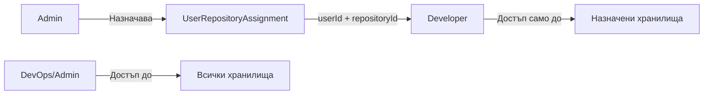

# Роли и управление на достъпа (RBAC)

## Роли

DWMAS използва три роли:

| Роля | Описание |
|---|---|
| `ADMIN` | Пълен достъп; управлява потребители, роли и всички хранилища |
| `DEVOPS` | Достъп до всички хранилища и workflow данни; не може да управлява роли |
| `DEVELOPER` | Достъп само до назначените хранилища; не може да добавя нови |

---

## Присвояване на роли

### При първо влизане (env allow-list)

Системата проверява GitHub ID/username срещу env променливи при OAuth callback:

```env
ADMIN_GITHUB_USERNAMES=alice,bob
ADMIN_GITHUB_IDS=111111,222222
DEVOPS_GITHUB_USERNAMES=charlie
DEVOPS_GITHUB_IDS=333333
```

- Съвпадение в admin list → роля `ADMIN`
- Съвпадение в devops list → роля `DEVOPS`
- Без съвпадение → роля `DEVELOPER` (по подразбиране)

### След първо влизане (Admin UI)

Администраторите могат да променят ролята от `/users`:
- `PUT /api/users/:userId` с `{ "role": "DEVOPS" }`

---

## Матрица на достъпа

| Действие | DEVELOPER | DEVOPS | ADMIN |
|---|---|---|---|
| Влизане / Изход | ✅ | ✅ | ✅ |
| Преглед на назначени хранилища | ✅ | ✅ | ✅ |
| Преглед на всички хранилища | ❌ | ✅ | ✅ |
| Добавяне на хранилище | ❌ | ✅ | ✅ |
| Редактиране на хранилище | ❌ | ✅ | ✅ |
| Изтриване на хранилище | ❌ | ❌ | ✅ |
| Синхронизация на хранилище | ❌ | ✅ | ✅ |
| Преглед на workflow изпълнения | ✅* | ✅ | ✅ |
| Преглед на аналитика | ✅* | ✅ | ✅ |
| Управление на issues | ✅* | ✅ | ✅ |
| Export на данни | ✅* | ✅ | ✅ |
| Управление на потребители | ❌ | ❌ | ✅ |
| Промяна на роли | ❌ | ❌ | ✅ |

`*` – само за назначени хранилища

---

## Присвояване на хранилища

Администраторите могат да назначават хранилища на Developer потребители от `/users`.

Правила:
- `Developer` вижда workflow данни само за:
  - хранилища, директно назначени чрез `UserRepositoryAssignment`
  - хранилища, които самият потребител е свързал/създал
- `DevOps` и `Admin` виждат всички хранилища



---

## RBAC Middleware

API-то прилага достъпа чрез три middleware функции:

### `requireAuth`
Проверява дали заявката има валидна сесия/JWT бисквитка. При неуспех връща `401`.

### `requireRoles(...roles)`
Проверява дали ролята на потребителя е в позволения списък. При неуспех връща `403`.

```ts
// Пример: само Admin и DevOps
router.post('/repositories', requireAuth, requireRoles('ADMIN', 'DEVOPS'), handler)
```

### `requireRepositoryAccess`
За Developer потребители проверява дали `req.params.repoId` е в назначените им хранилища. Admin/DevOps минават директно.

---

## Схема на базата данни

```prisma
enum Role {
  DEVELOPER
  DEVOPS
  ADMIN
}

model UserRepositoryAssignment {
  id           String @id @default(cuid())
  userId       String
  repositoryId String

  user       User       @relation(...)
  repository Repository @relation(...)

  @@unique([userId, repositoryId])
}
```

---

## Типичен поток за начална конфигурация

```
1. Добави GitHub username/ID в ADMIN_GITHUB_USERNAMES
2. Стартирай приложението
3. Влез с GitHub OAuth
4. Роля ADMIN се присвоява автоматично
5. Отвори /users
6. Насрочи роля DEVOPS на колега
7. Назначи Developer потребители към конкретни хранилища
```
