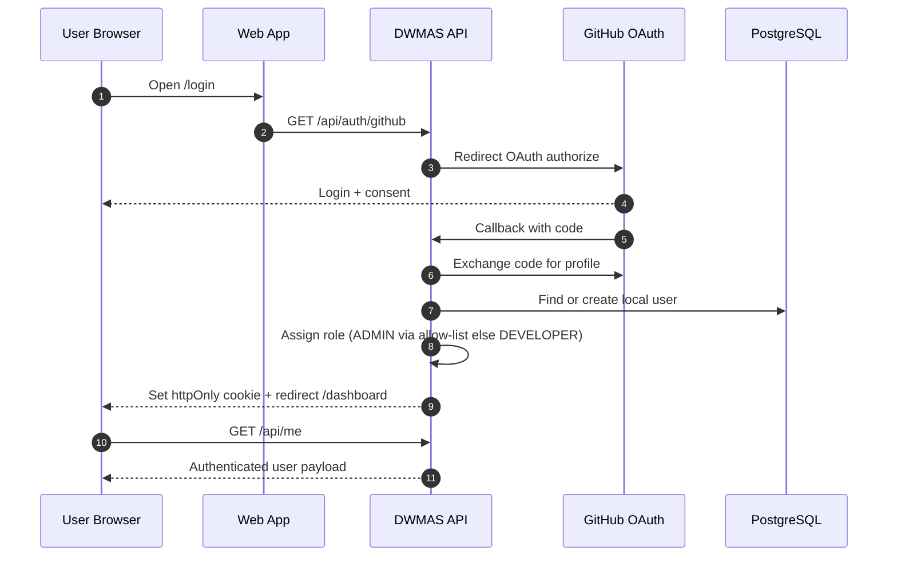

# GitHub OAuth Login Sequence

```mermaid
sequenceDiagram
  autonumber
  participant U as User Browser
  participant W as Web App
  participant API as DWMAS API
  participant GH as GitHub OAuth
  participant DB as PostgreSQL

  U->>W: Open /login
  W->>API: GET /api/auth/github
  API->>GH: Redirect OAuth authorize
  GH-->>U: Login + consent
  GH->>API: Callback with code
  API->>GH: Exchange code for profile
  API->>DB: Find or create local user
  API->>API: Assign role (ADMIN via allow-list else DEVELOPER)
  API-->>U: Set httpOnly cookie + redirect /dashboard
  U->>API: GET /api/me
  API-->>U: Authenticated user payload
```
