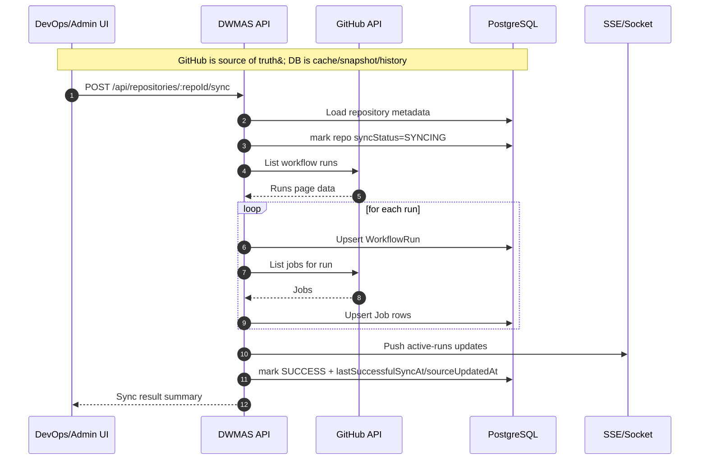

# Workflow Sync Sequence

```mermaid
sequenceDiagram
  autonumber
  participant UI as DevOps/Admin UI
  participant API as DWMAS API
  participant GH as GitHub API
  participant DB as PostgreSQL
  participant RT as SSE/Socket

  Note over UI,DB: GitHub is source of truth&#59; DB is cache/snapshot/history

  UI->>API: POST /api/repositories/:repoId/sync
  API->>DB: Load repository metadata
  API->>DB: mark repo syncStatus=SYNCING
  API->>GH: List workflow runs
  GH-->>API: Runs page data
  loop for each run
    API->>DB: Upsert WorkflowRun
    API->>GH: List jobs for run
    GH-->>API: Jobs
    API->>DB: Upsert Job rows
  end
  API->>RT: Push active-runs updates
  API->>DB: mark SUCCESS + lastSuccessfulSyncAt/sourceUpdatedAt
  API-->>UI: Sync result summary
```
