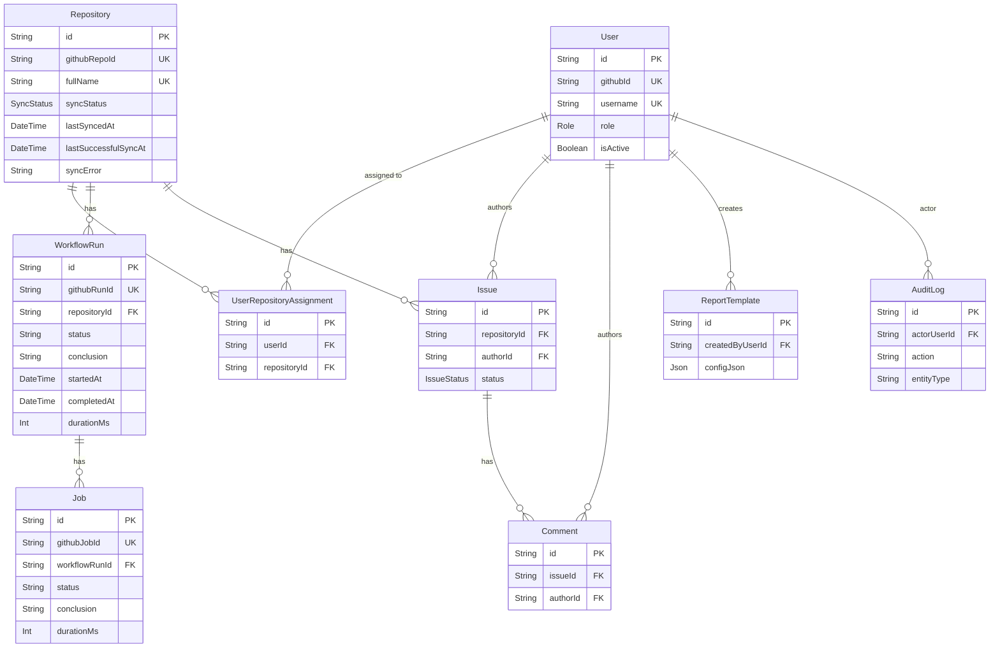
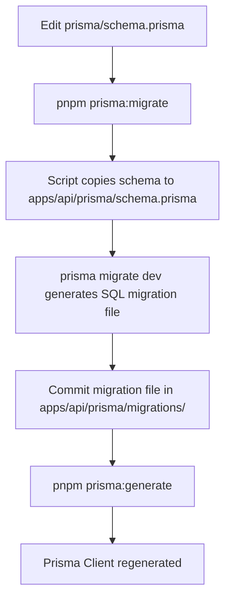

# Prisma Schema

Canonical Prisma schema for the API (PostgreSQL). The root schema at `prisma/schema.prisma` is the **single source of truth** — helper scripts copy it into `apps/api/prisma/schema.prisma` before running any Prisma CLI command.

## Commands (run from repo root)

```bash
pnpm prisma:generate   # copies schema into apps/api/prisma and runs prisma generate
pnpm prisma:migrate    # copies schema and runs prisma migrate dev
pnpm prisma:seed       # seeds via apps/api/src/prisma/seed.ts
```

Migrations are stored under `apps/api/prisma/migrations/` after running migrate.

> ⚠️ **Never edit `apps/api/prisma/schema.prisma` directly** — it is overwritten by the helper scripts.

---

## Schema Overview

### Models

| Model                       | Description                                                  |
|-----------------------------|--------------------------------------------------------------|
| `User`                      | Authenticated GitHub OAuth user; holds role and profile.     |
| `Repository`                | GitHub repository tracked by the system; includes sync metadata. |
| `UserRepositoryAssignment`  | Many-to-many join: which users can access which repositories. |
| `WorkflowRun`               | GitHub Actions workflow run snapshot synced from GitHub.     |
| `Job`                       | Individual job within a workflow run.                        |
| `Issue`                     | Local issue created inside DWMAS (not a GitHub issue).       |
| `Comment`                   | Comment on a local DWMAS issue.                              |
| `ReportTemplate`            | Saved filter/export configuration for analytics reports.     |
| `AuditLog`                  | Audit trail of actor + action + entity changes.              |

### Enums

| Enum              | Values                                        |
|-------------------|-----------------------------------------------|
| `Role`            | `DEVELOPER`, `DEVOPS`, `ADMIN`               |
| `SyncStatus`      | `IDLE`, `SYNCING`, `SUCCESS`, `ERROR`        |
| `IssueStatus`     | `OPEN`, `CLOSED`                             |
| `RepoTokenSource` | `USER_OAUTH`, `SYSTEM_TOKEN`                 |

---

## Entity Relationship Diagram



---

## Migration Workflow



---

## Sync Metadata on Repository

The `Repository` model carries sync lifecycle fields used by the API to track GitHub synchronisation state:

| Field                  | Type        | Description                                            |
|------------------------|-------------|--------------------------------------------------------|
| `syncStatus`           | `SyncStatus`| Current sync state: `IDLE`, `SYNCING`, `SUCCESS`, `ERROR` |
| `lastSyncedAt`         | `DateTime?` | Timestamp of last sync attempt.                        |
| `lastSuccessfulSyncAt` | `DateTime?` | Timestamp of last successful sync.                     |
| `syncError`            | `String?`   | Human-readable error message if last sync failed.      |
| `sourceUpdatedAt`      | `DateTime?` | `updated_at` timestamp from GitHub at last sync.       |

---

## Environment

- `DATABASE_URL` must point to your Postgres instance (see `.env.example`).
- Optional: `PRISMA_GENERATE_SKIP_AUTOINSTALL=1` — set automatically by the helper scripts to prevent Prisma from auto-installing the generated client's peer dependencies during `prisma generate`. You do not need to set this manually; it is only required when running `prisma generate` in CI or monorepo environments where dependency installation is managed externally (e.g., by `pnpm`).

---

## Notes

- Update `prisma/schema.prisma` here; do not edit `apps/api/prisma/schema.prisma` directly.
- After schema changes, run `pnpm prisma:migrate` (and commit the generated migration) and `pnpm prisma:generate`.

## Related docs

- [`docs/architecture.md`](../docs/architecture.md) — system-level architecture and data flow diagrams.
- [`docs/workflow-sync-sequence.md`](../docs/workflow-sync-sequence.md) — detailed sync sequence diagram.